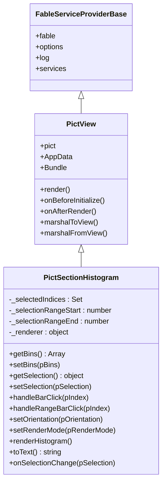
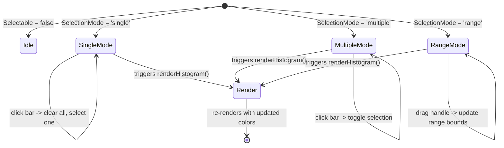

# Architecture

## Overview

`pict-section-histogram` extends `pict-view` and follows the Pict service provider pattern. The module separates concerns into a main view class that manages data, selection state, and lifecycle, and three interchangeable renderer modules that handle output for different environments.

## Module Structure

<!-- bespoke diagram: edit diagrams/module-structure.mmd or .hints.json, then: npx pict-renderer-graph build modules/pict/pict-section-histogram/docs -->


## Class Hierarchy



## Renderer Strategy Pattern

The histogram uses a strategy pattern for rendering. The main class holds a reference to the active renderer and delegates `render()` and `wireEvents()` calls to it. Renderers are swappable at runtime via `setRenderMode()`.

<!-- bespoke diagram: edit diagrams/renderer-strategy-pattern.mmd or .hints.json, then: npx pict-renderer-graph build modules/pict/pict-section-histogram/docs -->


Each renderer exports the same interface:

| Method | Description |
|--------|-------------|
| `render(pView)` | Build the visualization and assign it to the target element |
| `wireEvents(pView)` | Attach interactive event listeners (browser only; no-op for text modes) |

## Data Flow

<!-- bespoke diagram: edit diagrams/data-flow.mmd or .hints.json, then: npx pict-renderer-graph build modules/pict/pict-section-histogram/docs -->


### Data In

1. **DataAddress** -- If set, bins are resolved from the Pict address space (`AppData`, `Bundle`, `Options`) using manifesto dot-notation. Example: `"AppData.Survey.ResponseBins"`
2. **Bins option** -- Fallback static array provided in the configuration

### Data Out

1. **SelectionDataAddress** -- If set, the selection state object is written to the Pict address space after every change
2. **onSelectionChange** -- Callback hook fired with the selection state after every user interaction

## Selection State Machine



### Selection State Storage

| Mode | Internal State | `getSelection()` Output |
|------|---------------|------------------------|
| `single` | `_selectedIndices` Set (max 1 entry) | `{ Mode, SelectedIndices }` |
| `multiple` | `_selectedIndices` Set (any count) | `{ Mode, SelectedIndices }` |
| `range` | `_selectionRangeStart`, `_selectionRangeEnd` | `{ Mode, RangeStart, RangeEnd, SelectedIndices, StartLabel, EndLabel }` |

In range mode, `_selectedIndices` is kept in sync via `_syncSelectionFromRange()` so that `isIndexSelected()` works uniformly across all modes.

## Pict Lifecycle Integration

<!-- bespoke diagram: edit diagrams/pict-lifecycle-integration.mmd or .hints.json, then: npx pict-renderer-graph build modules/pict/pict-section-histogram/docs -->


### Standalone Usage (Without Full Lifecycle)

When used outside the Pict application lifecycle (e.g., in a simple HTML page), call `renderHistogram()` directly after adding the view. The method handles CSS injection, rendering, and event wiring in a single call.

```javascript
const tmpView = _Pict.addView('Demo', { ... }, PictSectionHistogram);
tmpView.renderHistogram(); // CSS + render + wireEvents
```

## Browser Renderer Internals

The browser renderer builds HTML strings and assigns them to the target element via `ContentAssignment.assignContent()`. This approach works with both real DOM (browser) and mock environments (tests using `pict-environment-log`).

### Bar Layout

**Vertical mode:** Flex row of bar groups, each containing value label (top), bar (middle), bin label (bottom). Bar height is proportional to value.

**Horizontal mode:** Flex column of bar groups, each containing bin label (left, fixed width), bar (middle), value label (right). Bar width is proportional to value.

### Range Slider

In range mode, a slider track with two draggable handles is rendered below (vertical) or beside (horizontal) the chart. Handles respond to `mousedown` -> `mousemove` -> `mouseup` events on the document to support drag outside the handle element.

## ConsoleUI and CLI Renderer Internals

Both text renderers produce Unicode block characters for bars. The ConsoleUI renderer outputs via `ContentAssignment.assignContent()` (compatible with blessed widgets). The CLI renderer outputs ANSI escape codes.

### Sub-Character Resolution

Vertical text histograms use fractional block characters (`▁▂▃▄▅▆▇█`) for sub-character height precision. Each character position represents 8 increments, giving smoother visual output than whole-character rounding.

### Color Mapping (CLI)

The CLI renderer maps CSS hex colors to the nearest ANSI 16-color palette entry by computing Euclidean distance in RGB space. This provides reasonable color approximation without requiring 256-color or truecolor terminal support.
